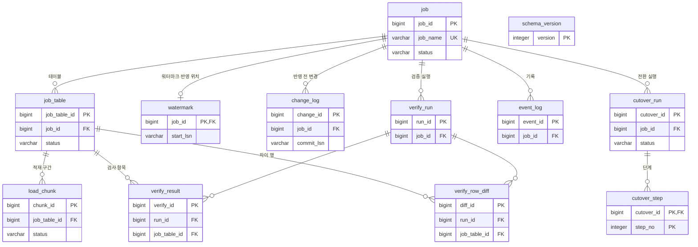
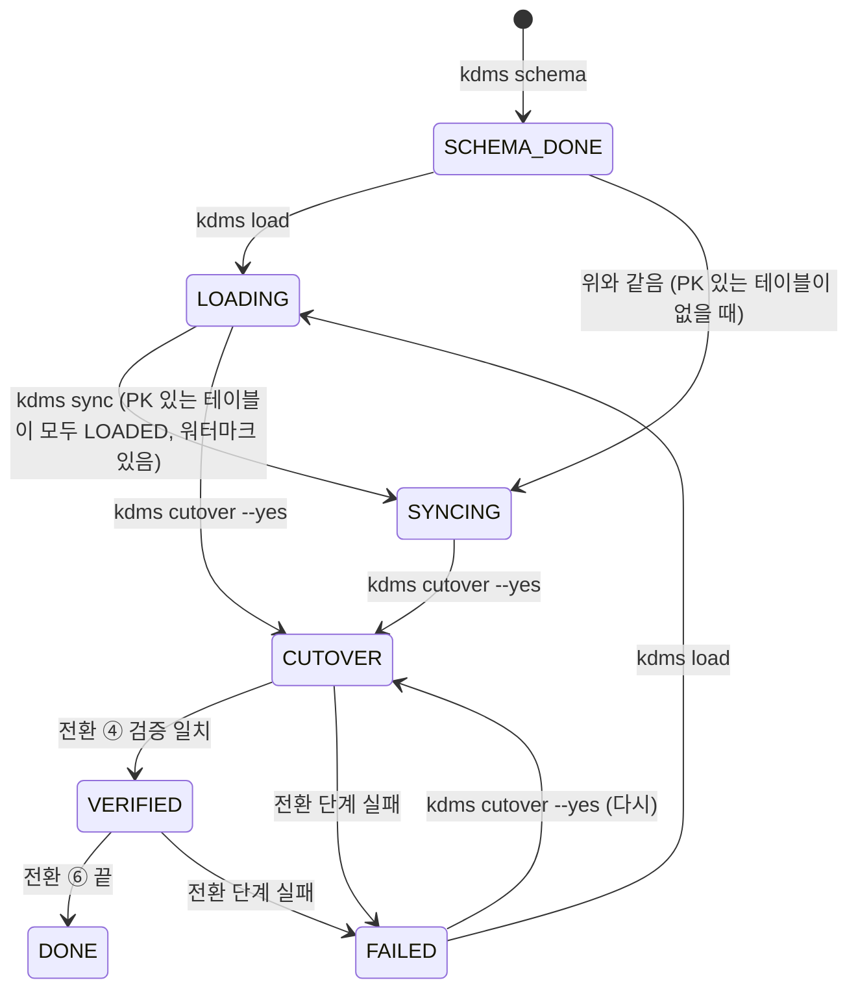

# 관리 스키마 `kdms` 테이블 정의서

> 상태: 확정 · 최종 갱신: 2026-10-09 · a43a5f8 · 근거: src/main/resources/db/kdms-schema.sql·kdms-schema-v2.sql·kdms-schema-v3.sql, kdms.cdc.DebeziumProps, PR #2·#9·#10

대상 PostgreSQL 의 `kdms` 스키마. 작업 진행·워터마크·변경분·검증·전환 기록을 둔다(DEC-08). 앱이 시작할 때 `kdms.state.SchemaInstaller` 가 버전 파일을 차례로 한 트랜잭션씩 적용한다(DEC-15).
**이 문서는 SQL 파일을 옮긴 것이다. 정의를 바꾸면 새 버전 파일을 더하고 이 문서를 함께 고친다.** 행 값(개인정보)·비밀번호를 남기는 컬럼은 두지 않는다. 예외는 `change_log.payload` 이며 반영하면 바로 지운다(plan.md §7 R8, DEC-34).

## 1. 관계도



FK 는 모두 `ON DELETE CASCADE` 다(작업을 지우면 그 기록이 함께 지워진다). `cutover_run.verify_run_id` 는 FK 가 아니다.
Debezium 이 쓰는 표 두 개(§2.13)는 이 관계도에 넣지 않았다(FK 없음, 작업마다 이름이 다름).

## 2. 테이블

키: PK 기본 키, FK 외래 키(→ 참조 표), UK 유일. 기본값 `identity` = `GENERATED ALWAYS AS IDENTITY`. "버전" 은 그 컬럼을 만든 스키마 버전(§4).

### 2.1 `schema_version` — 관리 스키마 버전

| No | 컬럼 | 타입 | NULL | 기본값 | 키 | 설명 |
|---|---|---|---|---|---|---|
| 1 | version | integer | N | | PK | 적용한 버전(1·2·3) |
| 2 | description | text | N | | | 버전 설명 |
| 3 | applied_at | timestamptz | N | now() | | 적용 시각 |

### 2.2 `job` — 작업 1건 = 원천 DB 1개 → 대상 DB 1개 (v1)

| No | 컬럼 | 타입 | NULL | 기본값 | 키 | 설명 |
|---|---|---|---|---|---|---|
| 1 | job_id | bigint | N | identity | PK | |
| 2 | job_name | varchar(100) | N | | UK | 설정 파일의 작업 이름 |
| 3 | src_server | varchar(200) | N | | | 원천 host:port(비밀번호 없음) |
| 4 | src_database | varchar(128) | N | | | 원천 DB |
| 5 | tgt_database | varchar(63) | N | | | 대상 DB |
| 6 | status | varchar(20) | N | 'PLANNED' | | 작업 상태(§3.1). CHECK |
| 7 | config_sha256 | char(64) | Y | | | 실행에 쓴 설정+규칙 파일 해시. 바뀌면 재시작 때 경고 |
| 8 | created_at | timestamptz | N | now() | | |
| 9 | updated_at | timestamptz | N | now() | | |
| 10 | last_error | text | Y | | | 마지막 오류(행 값 없음) |

### 2.3 `job_table` — 작업에 들어간 테이블 (v1, 9~12 는 v2)

| No | 컬럼 | 타입 | NULL | 기본값 | 키 | 설명 |
|---|---|---|---|---|---|---|
| 1 | job_table_id | bigint | N | identity | PK | |
| 2 | job_id | bigint | N | | FK → job, UK① | |
| 3 | src_schema | varchar(128) | N | | UK① | 원천 스키마 |
| 4 | src_table | varchar(128) | N | | UK① | 원천 테이블 |
| 5 | tgt_schema | varchar(63) | N | | UK② | 대상 스키마 |
| 6 | tgt_table | varchar(63) | N | | UK② | 대상 테이블 |
| 7 | has_pk | boolean | N | | | PK 없는 테이블은 변경분을 반영하지 않고 전환 때 재적재(plan.md §4.6) |
| 8 | status | varchar(20) | N | 'PENDING' | | 테이블 상태(§3.2). CHECK |
| 9 | rows_estimate | bigint | Y | | | 건수 추정 |
| 10 | rows_loaded | bigint | Y | | | 적재 행 수(끝난 구간 합) |
| 11 | load_started_at | timestamptz | Y | | | |
| 12 | load_finished_at | timestamptz | Y | | | |
| 13 | last_error | text | Y | | | |
| 14 | applied_commit_lsn | varchar(24) | Y | | | (v2) 이 테이블에 마지막으로 반영한 변경의 commit LSN |
| 15 | applied_change_lsn | varchar(24) | Y | | | (v2) 위 변경의 change LSN |
| 16 | applied_event_serial_no | bigint | Y | | | (v2) 위 변경의 event_serial_no. 이 위치 이하의 변경이 다시 오면 버린다 |
| 17 | changes_applied | bigint | N | 0 | | (v2) 반영한 변경 수 |

UK① = `(job_id, src_schema, src_table)`, UK② = `(job_id, tgt_schema, tgt_table)`. 인덱스 `ix_job_table_job (job_id)`.

### 2.4 `load_chunk` — 전체 적재 구간 (v1)

| No | 컬럼 | 타입 | NULL | 기본값 | 키 | 설명 |
|---|---|---|---|---|---|---|
| 1 | chunk_id | bigint | N | identity | PK | |
| 2 | job_table_id | bigint | N | | FK → job_table, UK | |
| 3 | chunk_no | integer | N | | UK | 테이블 안 구간 번호 |
| 4 | lower_bound | jsonb | Y | | | PK 컬럼 순서의 문자열 JSON 배열. 하한 포함, NULL = 끝 없음 |
| 5 | upper_bound | jsonb | Y | | | 상한 미포함, NULL = 끝 없음 |
| 6 | status | varchar(10) | N | 'PENDING' | | 구간 상태(§3.3). CHECK |
| 7 | row_count | bigint | Y | | | |
| 8 | elapsed_ms | bigint | Y | | | |
| 9 | attempts | integer | N | 0 | | 시도 횟수 |
| 10 | started_at | timestamptz | Y | | | |
| 11 | finished_at | timestamptz | Y | | | |
| 12 | last_error | text | Y | | | 위치만(행 값 없음, load-verify.md §2.4) |

UK = `(job_table_id, chunk_no)`. 인덱스 `ix_load_chunk_status (job_table_id, status)`. 구간 행과 DONE 표시는 한 트랜잭션(DEC-28).

### 2.5 `watermark` — 워터마크·반영 위치·동기화 진행 상태 (v1, 9~16 은 v2)

LSN(Log Sequence Number, 로그 순번)은 Debezium 표기 `xxxxxxxx:xxxxxxxx:xxxx`(고정 폭 16진수 소문자)라 문자열 비교 = LSN 순서다.

| No | 컬럼 | 타입 | NULL | 기본값 | 키 | 설명 |
|---|---|---|---|---|---|---|
| 1 | job_id | bigint | N | | PK, FK → job | 작업마다 한 행 |
| 2 | start_lsn | varchar(24) | N | | | 전체 적재 전에 기록한 스트리밍 시작 위치(cdc.md §2) |
| 3 | start_recorded_at | timestamptz | N | now() | | |
| 4 | applied_commit_lsn | varchar(24) | Y | | | 마지막으로 대상에 반영한 이벤트 |
| 5 | applied_change_lsn | varchar(24) | Y | | | |
| 6 | applied_event_serial_no | bigint | Y | | | |
| 7 | applied_src_commit_at | timestamptz | Y | | | 그 이벤트의 원천 커밋 시각 |
| 8 | applied_at | timestamptz | Y | | | |
| 9 | stream_lsn | varchar(24) | Y | | | (v2) Debezium 이 처리한 위치(하트비트·이벤트 오프셋) |
| 10 | src_max_lsn | varchar(24) | Y | | | (v2) 원천 CDC 의 마지막 트랜잭션 LSN |
| 11 | src_max_lsn_at | timestamp | Y | | | (v2) 그 커밋 시각(원천 서버 시계) |
| 12 | pending_changes | bigint | Y | | | (v2) 수집했지만 아직 반영하지 않은 변경 수 |
| 13 | lag_seconds | numeric(12,3) | Y | | | (v2) 지연(초, 정의는 DEC-36) |
| 14 | sync_status_at | timestamptz | Y | | | (v2) 진행 상태를 쓴 시각 |
| 15 | changes_captured | bigint | N | 0 | | (v2) 수집 누계 |
| 16 | changes_applied | bigint | N | 0 | | (v2) 반영 누계 |

### 2.6 `change_log` — 반영 전 변경 (v1, 인덱스는 v2)

| No | 컬럼 | 타입 | NULL | 기본값 | 키 | 설명 |
|---|---|---|---|---|---|---|
| 1 | change_id | bigint | N | identity | PK | |
| 2 | job_id | bigint | N | | FK → job, UK | |
| 3 | commit_lsn | varchar(24) | N | | UK | |
| 4 | change_lsn | varchar(24) | N | | UK | |
| 5 | event_serial_no | bigint | N | | UK | |
| 6 | op | char(1) | N | | | `c` 입력 · `u` 수정 · `d` 삭제. CHECK |
| 7 | src_schema | varchar(128) | N | | | |
| 8 | src_table | varchar(128) | N | | | |
| 9 | payload | jsonb | N | | | `{"before":{…},"after":{…}}` 원천 값. **반영하면 바로 지운다**(R8). NUL 이 든 문자열은 `{"b64":…}` |
| 10 | src_commit_at | timestamptz | Y | | | 원천 커밋 시각 |
| 11 | received_at | timestamptz | N | now() | | |

UK `uq_change_log_pos (job_id, commit_lsn, change_lsn, event_serial_no)` 로 재시작 때 중복 수신을 무시한다. 인덱스 `ix_change_log_apply (job_id, src_schema, src_table, commit_lsn, change_lsn, event_serial_no)`(v2, 테이블별 LSN 순서로 읽기).

### 2.7 `verify_run` — 검증 실행 (v1)

| No | 컬럼 | 타입 | NULL | 기본값 | 키 | 설명 |
|---|---|---|---|---|---|---|
| 1 | run_id | bigint | N | identity | PK | `kdms verify`·전환 ④ 한 번 |
| 2 | job_id | bigint | N | | FK → job | |
| 3 | started_at | timestamptz | N | now() | | |
| 4 | finished_at | timestamptz | Y | | | |
| 5 | checks | integer | Y | | | 검사 항목 수(KDMS_MOCK 30) |
| 6 | mismatches | integer | Y | | | 불일치 수 |

### 2.8 `verify_result` — 검사 항목 결과 (v1)

| No | 컬럼 | 타입 | NULL | 기본값 | 키 | 설명 |
|---|---|---|---|---|---|---|
| 1 | verify_id | bigint | N | identity | PK | |
| 2 | run_id | bigint | N | | FK → verify_run | |
| 3 | job_table_id | bigint | N | | FK → job_table | |
| 4 | check_kind | varchar(10) | N | | | `count`·`sum`·`hash`. CHECK |
| 5 | check_target | varchar(128) | N | '' | | `sum` 이면 컬럼 이름 |
| 6 | src_value | text | Y | | | 건수·합계·해시 합(숫자만, 행 값 없음) |
| 7 | tgt_value | text | Y | | | |
| 8 | matched | boolean | N | | | |
| 9 | checked_at | timestamptz | N | now() | | |

인덱스 `ix_verify_result_run (run_id)`.

### 2.9 `verify_row_diff` — 불일치 행 (v1)

| No | 컬럼 | 타입 | NULL | 기본값 | 키 | 설명 |
|---|---|---|---|---|---|---|
| 1 | diff_id | bigint | N | identity | PK | |
| 2 | run_id | bigint | N | | FK → verify_run | |
| 3 | job_table_id | bigint | N | | FK → job_table | |
| 4 | pk | jsonb | N | | | PK 정규화 문자열 JSON 배열(다른 컬럼 값은 없음). 테이블마다 앞 100건 |
| 5 | side | varchar(8) | N | | | `missing` 원천에만 · `extra` 대상에만 · `diff` 해시 다름. CHECK |

인덱스 `ix_verify_row_diff_run (run_id, job_table_id)`.

### 2.10 `event_log` — 단계 시작·끝·오류 (v1)

| No | 컬럼 | 타입 | NULL | 기본값 | 키 | 설명 |
|---|---|---|---|---|---|---|
| 1 | event_id | bigint | N | identity | PK | |
| 2 | job_id | bigint | Y | | FK → job | |
| 3 | logged_at | timestamptz | N | now() | | |
| 4 | level | varchar(5) | N | | | `INFO`·`WARN`·`ERROR`. CHECK |
| 5 | stage | varchar(20) | N | | | 코드가 쓰는 값: `schema`·`load`·`sync`·`verify`·`cutover`·`reset` |
| 6 | message | text | N | | | 행 값·비밀번호 없음 |

인덱스 `ix_event_log_job (job_id, logged_at)`. 웹 화면은 최근 15건을 보여 준다.

### 2.11 `cutover_run` — 전환 한 번 (v3)

| No | 컬럼 | 타입 | NULL | 기본값 | 키 | 설명 |
|---|---|---|---|---|---|---|
| 1 | cutover_id | bigint | N | identity | PK | `kdms cutover` 실행 한 번. 다시 실행하면 새 행 |
| 2 | job_id | bigint | N | | FK → job | |
| 3 | started_at | timestamptz | N | now() | | |
| 4 | src_started_at | timestamp | Y | | | 시작 때 원천 서버 시각(원천 시계) |
| 5 | finished_at | timestamptz | Y | | | |
| 6 | status | varchar(10) | N | 'RUNNING' | | `RUNNING`·`DONE`·`FAILED`. CHECK |
| 7 | elapsed_ms | bigint | Y | | | 시작~끝 = 예상 다운타임(plan.md §4.5 ⑦) |
| 8 | verify_run_id | bigint | Y | | | 이 전환에서 돌린 검증(`verify_run.run_id`, FK 아님) |
| 9 | last_error | text | Y | | | |

인덱스 `ix_cutover_run_job (job_id, cutover_id)`.

### 2.12 `cutover_step` — 전환 단계 (v3)

| No | 컬럼 | 타입 | NULL | 기본값 | 키 | 설명 |
|---|---|---|---|---|---|---|
| 1 | cutover_id | bigint | N | | PK, FK → cutover_run | |
| 2 | step_no | integer | N | | PK | 1~6 |
| 3 | step | varchar(20) | N | | | 코드가 쓰는 값: `drain`·`reload`·`post_load`·`verify`·`setval`·`fk`(cutover.md §2) |
| 4 | status | varchar(10) | N | | | `RUNNING`·`DONE`·`FAILED`·`SKIPPED`. CHECK |
| 5 | started_at | timestamptz | N | now() | | |
| 6 | finished_at | timestamptz | Y | | | |
| 7 | elapsed_ms | bigint | Y | | | |
| 8 | detail | text | Y | | | 요약(숫자와 이름만) |

### 2.13 Debezium 표 (`debezium-storage-jdbc` 가 만든다, DEC-14)

SQL 파일이 아니라 `kdms.cdc.DebeziumProps` 의 DDL 설정으로 Debezium 이 처음 시작할 때 만든다. 작업마다 따로(`<job_id>`).

| 표 | 컬럼 |
|---|---|
| `debezium_offset_<job_id>` | `id varchar(36) NOT NULL`, `offset_key text`, `offset_val text`, `record_insert_ts timestamp NOT NULL`, `record_insert_seq integer NOT NULL`. PK 없음(저장할 때마다 표 전체를 다시 쓴다) |
| `debezium_schema_history_<job_id>` | `id varchar(36) NOT NULL`, `history_data text`, `history_data_seq integer`, `record_insert_ts timestamp NOT NULL`, `record_insert_seq integer NOT NULL`, PK `(id, history_data_seq)` |

`kdms reset --yes` 가 오프셋을 지운다(cdc.md §1).

## 3. 코드값과 상태 전이

### 3.1 `job.status`

CHECK: `PLANNED`, `SCHEMA_DONE`, `LOADING`, `SYNCING`, `CUTOVER`, `VERIFIED`, `DONE`, `FAILED`.



`kdms reset --yes` 는 상태와 관계없이 SCHEMA_DONE 으로 되돌린다(같은 작업의 sync·load·cutover 가 돌고 있으면 거부). 그림에서는 뺐다.

| 값 | 누가 넣나 | 이 상태에서 되는 명령 |
|---|---|---|
| PLANNED | 기본값. 지금 코드는 쓰지 않는다(`kdms schema` 가 바로 SCHEMA_DONE 으로 등록) | — |
| SCHEMA_DONE | `kdms schema`, `kdms reset --yes` | load·sync·schema --replace |
| LOADING | `kdms load` 시작(적재 실패 테이블이 있어도 LOADING + `last_error`) | load·sync·cutover(`--no-cdc`) |
| SYNCING | `kdms sync`: PK 있는 테이블이 모두 LOADED 이고 워터마크가 있을 때 | load·sync·cutover |
| CUTOVER | `kdms cutover` 시작. 중간에 죽으면 여기 남는다 | cutover(다시) |
| VERIFIED | 전환 ④ 통과 | cutover(다시) |
| DONE | 전환 끝 | 없음(cutover 거부) |
| FAILED | 전환 단계 실패 | load·sync·cutover(다시) |

- `kdms schema`(적재 전)·`--replace` 는 LOADING 이후 상태면 거부한다(`SchemaApplier.STARTED`).
- `reset` 은 sync·load 가 돌고 있으면 거부, `cutover` 중에는 sync·load·reset·schema 가 거부된다(cutover.md §2).

### 3.2 `job_table.status`

CHECK: `PENDING`, `LOADING`, `LOADED`, `SYNCING`, `VERIFIED`, `FAILED`, `EXCLUDED`.

```
PENDING ─(load 시작)─> LOADING ─(구간 모두 DONE)─> LOADED
                          └─(구간 실패)─> FAILED ─(load 다시)─> LOADING
LOADED·FAILED ─(load --reset, reset --yes)─> PENDING
```

- 반영기는 `LOADED` 인 테이블의 변경만 적용한다(cdc.md §2).
- `SYNCING`·`VERIFIED` 는 CHECK 에만 있고 지금 코드는 쓰지 않는다. `EXCLUDED` 는 코드가 "끝난 것" 으로 세지만 넣는 코드는 아직 없다(설정으로 제외, plan.md §4.6 — 미구현).

### 3.3 `load_chunk.status`

CHECK: `PENDING`, `RUNNING`, `DONE`, `FAILED`. `PENDING → RUNNING → DONE | FAILED`. 다시 적재하면 DONE 이 아닌 구간(RUNNING·FAILED·PENDING)만 처음부터(load-verify.md §2.2).

### 3.4 그 밖의 코드값

| 표.컬럼 | 값 |
|---|---|
| `change_log.op` | `c` 입력, `u` 수정, `d` 삭제(PK 바꾸는 수정은 d + c 두 이벤트) |
| `verify_result.check_kind` | `count`, `sum`, `hash` |
| `verify_row_diff.side` | `missing`, `extra`, `diff` |
| `event_log.level` | `INFO`, `WARN`, `ERROR` |
| `cutover_run.status` | `RUNNING → DONE | FAILED` |
| `cutover_step.status` | `RUNNING → DONE | SKIPPED | FAILED` |

## 4. 스키마 버전 이력

| 버전 | 날짜 | 파일 | 변경 | 이유 | 관련 단계 |
|---|---|---|---|---|---|
| v1 | 2026-10-01 | `kdms-schema.sql` | 스키마 `kdms`, `schema_version`·`job`·`job_table`·`load_chunk`·`watermark`·`change_log`·`verify_run`·`verify_result`·`verify_row_diff`·`event_log`, 인덱스 5개 | plan.md §4.2 관리 테이블 최초 생성. plan 에 없던 `verify_run`(검증 실행 묶음)을 더함 | 1단계 PR #2 |
| v2 | 2026-10-08 | `kdms-schema-v2.sql` | `job_table` 에 테이블별 반영 위치 3개·`changes_applied`, `watermark` 에 동기화 진행 상태 8개, 인덱스 `ix_change_log_apply` | 반영기가 테이블별로 LSN 순서를 지키고 재시작 때 이미 반영한 변경을 버리기 위해. 화면·`kdms status` 가 지연·대기를 읽기 위해 | 4단계 PR #9 |
| v3 | 2026-10-08 | `kdms-schema-v3.sql` | `cutover_run`·`cutover_step`, 인덱스 `ix_cutover_run_job` | 전환 한 번과 단계별 소요 시간(예상 다운타임)을 남기기 위해 | 5단계 PR #10 |

날짜는 그 파일이 main 에 들어간 머지 커밋 날짜(42850ee·4a0dadd·a43a5f8).
