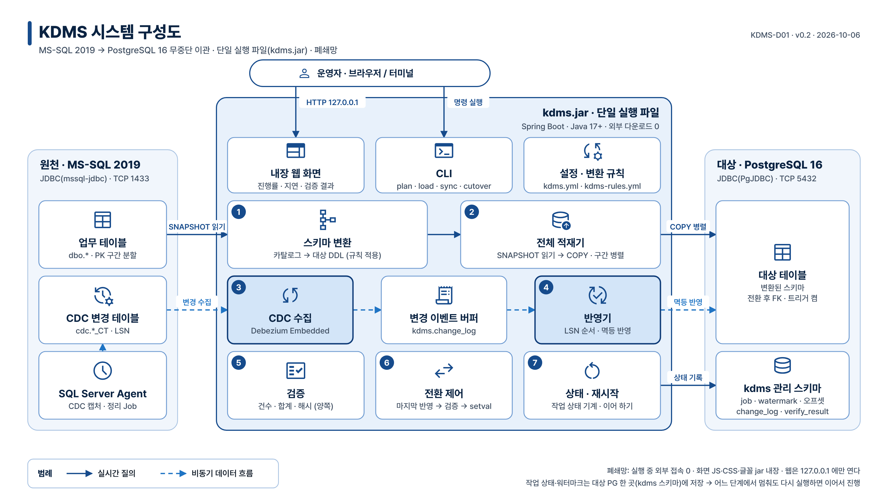

# KDMS 설계 문서

> 상태: 진행 중 · 최종 갱신: 2026-10-09 · 94d9f72 · 근거: PR #6·#7(머지), D04·D05·D08·D09 초안 draft PR

구성도·흐름도·아키텍처·일정 같은 그림 문서를 모은 곳. 목록은 [index.html](index.html)(브라우저로 연다).



지금 범위(2026-10-06 사용자 결정, DEC-42): D01 구성도 · D02 SW 아키텍처 · D03 이관 흐름도 · D06 개발 일정(확정), D07 변환 규칙 매핑표(확정, 2026-10-09), D04 데이터 흐름도 · D05 관리 테이블 ERD · D08 검증 계획서 · D09 전환·롤백 절차서(초안, 3~5단계분). 나머지는 해당 단계에서 만든다(index.html 의 "N단계에 작성").

## 형식

| 무엇 | 파일 | 용도 |
|---|---|---|
| 원본 | `tools/d??_*.py`(그림 정의·설명) → `d??-*.html`, `diagrams/d??-*.svg` | git 으로 변경 이력 관리. 브라우저로 바로 열린다 |
| 문서 배포본 | `dist/d??-*.pdf` | A4 가로. 1쪽 그림, 2쪽부터 설명 |
| 발표용 | `dist/d??-*.pptx` | 16:9 한 장. 블록·글·아이콘·연결선이 모두 PowerPoint 도형이라 편집할 수 있다(이미지 없음). 블록을 옮기면 연결선이 따라간다 |
| 미리보기 | `dist/d??-*.png` | 3200×1800 |

HTML·SVG 는 외부 접속 없이 열린다(폐쇄망). 글꼴은 `assets/fonts/`, 아이콘은 `assets/icons/` 에 있다.
PPTX 는 글꼴을 넣지 않으므로 발표 PC 에 `assets/fonts/otf/` 의 Pretendard(Regular·Bold)를 설치해야 모양이 같다(없으면 다른 글꼴로 바뀐다).

## 스타일

사용자 다이어그램 규칙(`/diagram-style`, 2026-10-09 갱신)을 따른다. 값은 `tools/diagram.py` 의 `C`(색)·`T`(글자 크기) 한 곳에서 정하고 `assets/doc.css` 변수와 맞춘다.

- 캔버스 1600×900(16:9). 흰 배경 `#FFFFFF`, 플랫, 그림자·그라데이션 없음.
- 색: 이 프로젝트는 녹색 계열(사용자 2026-10-09). 규칙의 네이비·스카이블루 자리에 같은 역할로 넣는다: 진한 녹색 `#0B3D2E`(제목·강조 블록), `#1E6B4F`(실선·아이콘), 밝은 녹색 `#2E9E6E`(점선), 블록 테두리 `#9DD3B8`, 영역 바탕 `#EEF8F3`. 주의 표시는 연한 채움 `#D5EFE2` + 진한 테두리.
- 글자(최소 17px, 슬라이드에서 10pt 이상): 설명·선 라벨·범례·영역 메모 17px, 블록 제목·영역 이름 20px, 부제 18px, 그림 제목 36px. 넘치면 글자를 줄이지 않고 문장을 줄이거나 블록을 넓힌다(`Diagram.check()`).
- 둥근 사각형(영역 r18, 블록 r12), 블록 안은 아이콘(위)과 글(아래). 강조(진한 녹색 채움 + 흰 글자)는 주 경로에만.
- 블록 왼쪽 위 원 안 숫자 = 실행 순서. 그림 안 작은 글자에는 원 문자(①)를 쓰지 않고 `1.`·`4 ~ 7` 처럼 쓴다.
- 글꼴 Pretendard, 문맥 대체(`calt`) 끔(`0x0a` 가 `0×0a` 로 바뀌지 않게, SVG·HTML). 아이콘 Material Symbols(Outlined). 라이선스는 [../licenses.md](../licenses.md) §6.
- 범례는 왼쪽 아래. 구성도: 실선 = 실시간 질의, 점선 = 비동기 데이터 흐름. 흐름도(D03): 실선 = 처리 순서, 점선 = 불합격 시 되돌아가는 경로, 판단은 마름모, 시작·끝은 진한 남색 알약, 줄이 바뀌는 곳은 같은 글자 연결점(원 안 A).
- 화살표는 데이터가 가는 방향(원천 → 대상), 누가 질의하는지는 라벨로. 읽기 전용 원천으로 들어가는 화살표는 그리지 않는다.
- 업무 구성도에 시험 환경 요소(노트북·AI 도구·저장소 호스팅)를 넣지 않는다.
- PPTX 는 Pretendard 문맥 대체를 끄는 설정이 없다(PowerPoint 기본은 꺼짐).

## 다시 만들기

```bash
python3 docs/design/tools/build.py    # HTML·SVG·index.html (표준 라이브러리만)
python3 docs/design/tools/export.py   # + PNG·PDF (Chromium 헤드리스), PPTX (python-pptx, 편집 가능한 도형)
```

- `export.py` 는 Chromium 을 찾아 쓴다. 다른 경로면 `CHROME=<경로>` 로 지정한다.
- 새 문서는 `tools/d01_system_architecture.py` 를 본떠 `build()`(그림)와 `EXPLAIN`(설명 HTML)을 만들고 `build.py` 의 `DOCS` 에 `module` 을 적는다.
